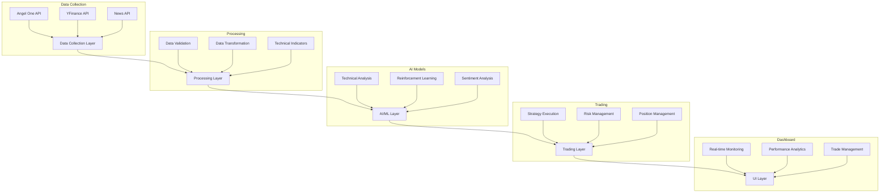
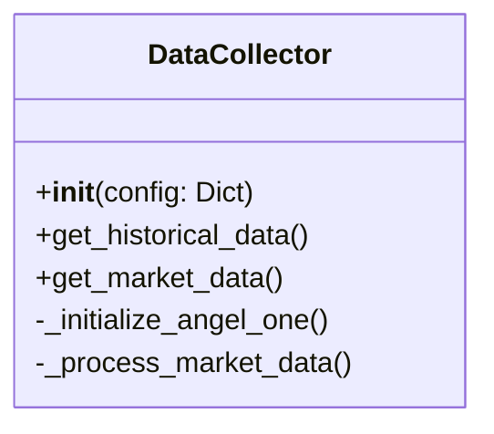
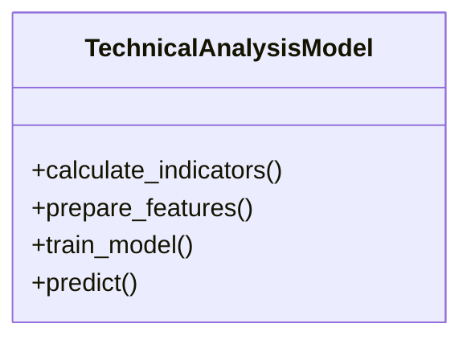
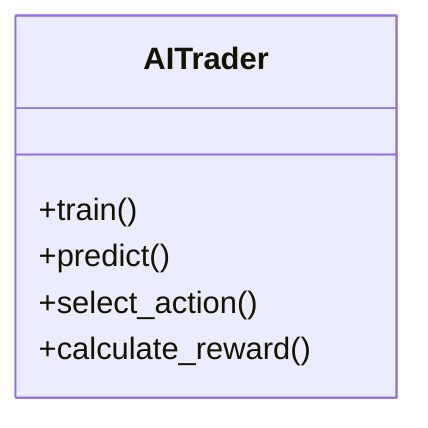
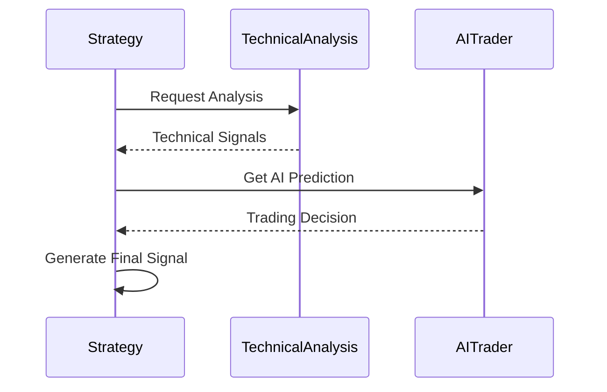
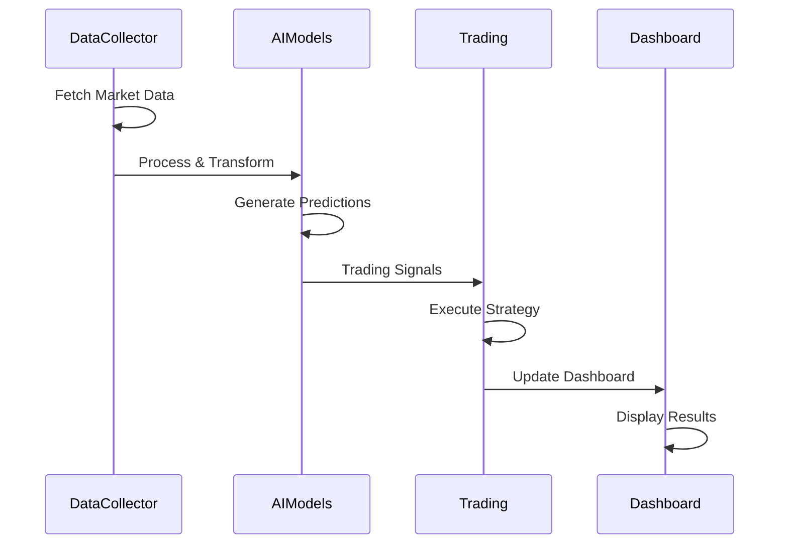
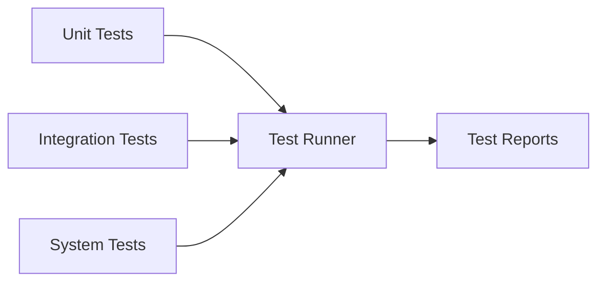
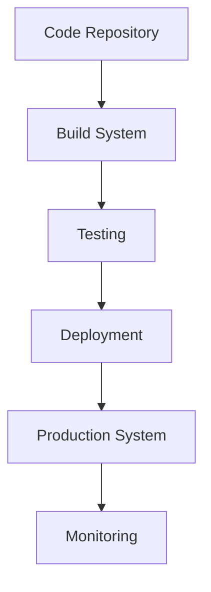

# AI-Based Trading System Documentation

## System Architecture



## Project Structure

```
📦 AI Trading System
├── 📁 src/
│   ├── 📁 ai/               # AI and ML components
│   ├── 📁 data/            # Data collection and processing
│   ├── 📁 trading/         # Trading logic and execution
│   ├── 📁 ui/              # User interface components
│   └── 📄 main.py          # Application entry point
├── 📁 tests/               # Test suites
├── 📁 models/              # Trained model storage
├── 📁 logs/                # Application logs
└── 📄 config.yaml          # System configuration
```

## Component Details

### 1. Data Collection Layer (`src/data/`)

#### DataCollector Class (`collector.py`)
- Primary data collection orchestrator
- Implements real-time market data fetching
- Handles multiple data sources (Angel One, YFinance)
- Features:
  - Real-time data streaming
  - Historical data retrieval
  - Technical indicator calculation
  - Data caching mechanism



### 2. AI/ML Layer (`src/ai/`)

#### 2.1 Technical Analysis Model (`models.py`)
- Implements technical analysis indicators
- Feature engineering
- Price prediction models



#### 2.2 Reinforcement Learning (`models.py`)
- Trading strategy optimization
- Q-Learning implementation
- Policy gradient methods



#### 2.3 Training Pipeline (`training_pipeline.py`)
- Model training orchestration
- Hyperparameter optimization
- Feature engineering pipeline

### 3. Trading Layer (`src/trading/`)

#### 3.1 Trading Strategy (`strategy.py`)
- Trading signal generation
- Position sizing logic
- Entry/exit rules



#### 3.2 Risk Management (`manager.py`)
- Position sizing
- Stop-loss management
- Portfolio risk controls

### 4. UI Layer (`src/ui/`)

#### Dashboard (`dashboard.py`)
- Real-time market visualization
- Portfolio performance metrics
- Trading interface
- Technical analysis charts

## Data Flow



## Configuration (`config.yaml`)

The system is configured through `config.yaml` with the following main sections:
- API credentials
- Trading parameters
- Model configurations
- Risk management settings
- UI preferences

## Testing Framework



### Test Categories
1. Unit Tests
   - Model testing
   - Strategy validation
   - Data processing verification

2. Integration Tests
   - API integration
   - Model pipeline testing
   - Trading execution

3. System Tests
   - End-to-end workflows
   - Performance testing
   - Stress testing

## Dependencies
- TensorFlow/PyTorch: Deep learning
- TA-Lib: Technical analysis
- Pandas: Data processing
- Streamlit: UI framework
- SmartAPI: Angel One integration
- YFinance: Market data
- NewsAPI: News data

## Deployment



### Environment Setup
1. Install Python dependencies:
```bash
pip install -r requirements.txt
```

2. Configure API credentials in `config.yaml`

3. Initialize the system:
```bash
python src/main.py
```

## Monitoring and Logging

The system implements comprehensive logging across all components:
- Application logs (`logs/`)
- Performance metrics
- Error tracking
- API call monitoring

## System Requirements

- Python 3.9+
- 8GB RAM minimum
- Windows/Linux/MacOS
- Internet connection for real-time data
- API access credentials

## Future Enhancements

1. Advanced Features
   - Market microstructure analysis
   - Alternative data integration
   - Advanced portfolio optimization

2. Technical Improvements
   - Distributed computing support
   - Real-time analytics
   - Enhanced visualization

3. AI/ML Enhancements
   - Deep reinforcement learning
   - Sentiment analysis improvements
   - Model ensemble techniques
